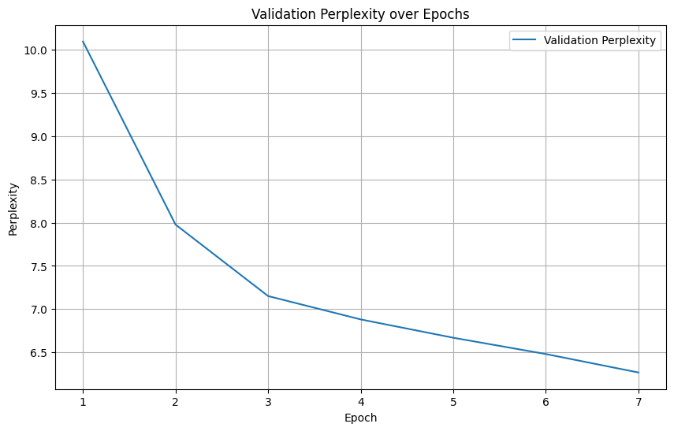

# 🎵 Music Transformer on JSB Chorales

This project implements and trains a **Music Transformer** on the **JSB
Chorales dataset** to learn sequence modeling for symbolic music
generation.

------------------------------------------------------------------------

## 📂 Project Structure

-   `music_transformer.ipynb` → Main Jupyter Notebook containing the
    model, training, and evaluation code.\
-   `graphs/` → Contains training & evaluation plots.
    -   `accuracy.png`\
    -   `perplexity.png`\
    -   `trainVSval.png`\
-   `final_model.pth` → Saved trained model weights.
-   `requirements.txt`

------------------------------------------------------------------------

## 📊 Training Results

### Accuracy


### Perplexity



### Training vs Validation Loss


------------------------------------------------------------------------

## 🏆 Final Evaluation

-   **Evaluation Loss**: \~0.275
-   **Perplexity**: \~1.316
-   **Accuracy**: \~92.8%

------------------------------------------------------------------------

## 🚀 How to Use

1.  Clone this repository:

    ``` bash
    git clone https://github.com/lakshinkhurana/music-transformer.git
    cd music-transformer
    ```

2.  Open the Jupyter Notebook:

    ``` bash
    pip install -r requirements.txt
    jupyter notebook music_transformer.ipynb
    ```

3.  To load the trained model:

    ``` python
    import torch
    from model import MusicTransformer  # adjust if model class is defined inside notebook

    model = MusicTransformer(...)
    model.load_state_dict(torch.load("final_model.pth", map_location="cpu"))
    model.eval()
    ```

------------------------------------------------------------------------

## 📥 Download Pretrained Model

You can download the trained Music Transformer model here:

➡️ [**final_model.pth**](final_model.pth)
